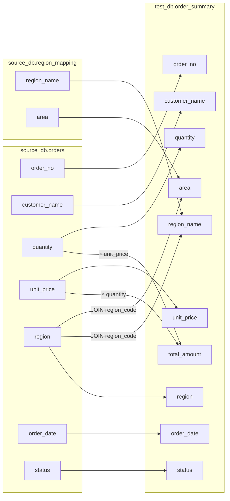

# 字段级血缘图谱设计文档

## 概述

在 ETL 流程完成后（Step 7），自动生成字段级数据血缘图谱，以 Mermaid 语法输出，通过现有 render 机制展示给用户。

## 需求

- **粒度**：字段级血缘，展示每个目标字段的来源字段、计算逻辑、JOIN 关系
- **触发时机**：ETL 流程最后一步（Step 7），在数据质量检查和异常溯源之后
- **输出格式**：Mermaid `graph LR` 语法，通过 render 工具展示
- **实现方式**：新增 `generate_lineage` 工具，接收结构化的节点和边数据

## 方案选型

| 方案 | 优点 | 缺点 | 结论 |
|------|------|------|------|
| A. Mermaid 文本 | 零前端依赖、改动最小、通用标准 | 不可交互 | **采用** |
| B. HTML 页面 | 可交互、效果好 | 工作量大、新增依赖 | 否 |
| C. PNG 图片 | 所见即所得 | 需系统依赖、不可交互 | 否 |

## ETL 流程（7 步）

```
1. 连接数据库
2. 选择基表
3. 定义目标表结构
4. 建立字段映射
5. 数据质量检查
6. 异常溯源
7. 生成血缘图谱  ← 新增
```

## 工具设计

### `generate_lineage` 工具

```python
@tool
def generate_lineage(
    nodes: list[dict],
    edges: list[dict],
    title: str = ""
) -> str:
    """根据字段级血缘的节点和边生成 Mermaid 图谱。

    Args:
        nodes: 节点列表，每个节点包含：
            - id: 唯一标识（如 "src.orders.quantity"）
            - table: 所属表（如 "source_db.orders"）
            - column: 字段名（如 "quantity"）
        edges: 边列表，每条边包含：
            - from: 源节点 id
            - to: 目标节点 id
            - label: 可选，转换说明（如 "× unit_price"、"JOIN region_code"）
        title: 图谱标题
    """
```

### 工具职责

1. 接收 executor 传入的结构化节点和边
2. 按 `table` 字段自动分组生成 Mermaid `subgraph`
3. 生成节点定义和边连接
4. 通过 `make_rich_result(result_type="lineage")` 返回

### executor 的职责

1. 读取 `artifacts.field_mapping_sql`（INSERT INTO ... SELECT）
2. 分析 SQL 中的字段来源、计算表达式、JOIN 关系
3. 构造 nodes 和 edges 参数调用 `generate_lineage`

## 输出示例

以 `source_db.orders` + `source_db.region_mapping` → `test_db.order_summary` 为例：



## 改动文件清单

| 文件 | 操作 | 说明 |
|------|------|------|
| `app/tools/lineage.py` | 新增 | `generate_lineage` 工具实现（~60 行） |
| `app/tools/__init__.py` | 修改 | 注册 `generate_lineage` 到 `ALL_TOOLS` |
| `app/agent/graph.py` | 修改 | `DEFAULT_PLAN` 增加 Step 7 |
| `app/agent/nodes.py` | 修改 | `_format_payload_to_markdown` 增加 `lineage` 类型渲染 |
| `test_e2e.py` | 修改 | 增加 Step 7 测试 |

### 不需要改动的文件

- `state.py` — 不需要新增 artifacts 字段
- `system_prompt.py` — executor prompt 已足够通用
- `websocket.py` — 复用现有 response 消息类型
- `schemas.py` — StepResult 不需要变

## `generate_lineage` 核心实现

```python
def generate_lineage(nodes, edges, title="") -> str:
    # 1. 按 table 分组 nodes
    groups = defaultdict(list)
    for node in nodes:
        groups[node["table"]].append(node)

    # 2. 生成 Mermaid
    lines = ["graph LR"]
    for table, table_nodes in groups.items():
        lines.append(f"  subgraph {table}")
        for n in table_nodes:
            lines.append(f"    {n['id']}[{n['column']}]")
        lines.append("  end")

    for edge in edges:
        label = edge.get("label", "")
        if label:
            lines.append(f"  {edge['from']} -->|\"{label}\"| {edge['to']}")
        else:
            lines.append(f"  {edge['from']} --> {edge['to']}")

    mermaid_code = "\n".join(lines)

    # 3. 返回结构化结果
    return make_rich_result(
        tool_name="generate_lineage",
        result_type="lineage",
        title=title or "字段级数据血缘图谱",
        mermaid=mermaid_code,
        summary=f"已生成血缘图谱，包含 {len(nodes)} 个字段节点和 {len(edges)} 条血缘关系",
    )
```

## 渲染逻辑

在 `_format_payload_to_markdown` 中增加：

```python
if payload.get("result_type") == "lineage":
    mermaid_code = metadata.get("mermaid") or payload.get("mermaid", "")
    if mermaid_code:
        sections.append(f"```mermaid\n{mermaid_code}\n```\n")
```

## 预估工作量

新增代码约 80-100 行，涉及 5 个文件。
